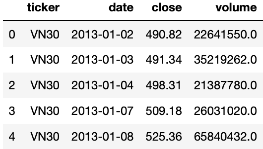

# DELAFO : DeEp Learning Approach for portFolio Optimization
## Applications
--------------
#### Predict the optimized portfolio (based on Sharpe ratio) in future
    * Formulate the portfolio optimization as a supervise problem.
    * with input is the past event(Default is price and volume of market in 64 days ago).
    * predict the tickers should be in our portfolios in future . Evaluate by the Sharpe ratio (Default is next 19 working days~ around one next month).
    * All the tickers have same proportion in this porfolio.

## Training
--------------
#### All the data will be preprocessed before using to train our models.(preprocess_data.py)
    * with input is the past event(price and volume of market in 64 days ago).
    * predict the future tickers should be in our portfolios. (next 19 working days~ around one next month).


## Usage:
```bash
python main.py --data_path path/to/data --model model/name --timesteps_input time/window/input --timesteps_input time/window/output
```
### model_name : all available models at the moment are:
 * ['ResNet' , 'GRU' , 'LSTM' , 'AA_GRU' , 'AA_LSTM' , 'SA_GRU' , 'SA_LSTM'] with corresponding config file in config folder.
 * You can change the configuration of these models by changing the config file in config folder (We do not recommend to do it, because these hyperparameters had been tuned for these models).
 * You can design your own model by put it in models folder.
### DATA
  * Must be in csv file.
  * Now all the models just support for data have 4 fields ['ticker','date','price','volume'] like in picture:
  

## Requirement:
